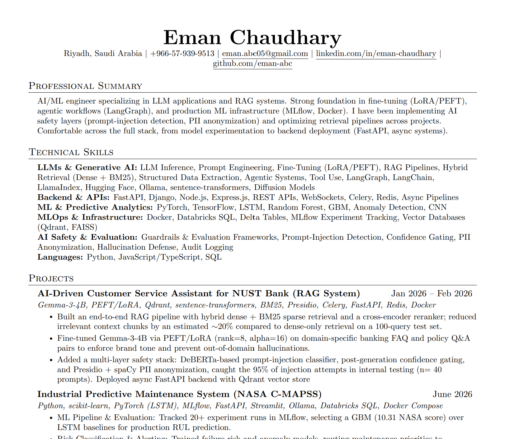

<h1 align="center">Hi, I'm Eman Chaudhary </h1>
<h3 align="center">AI Engineer · LLM & RAG Systems · NUST '26</h3>

<p align="center">
  <a href="https://www.linkedin.com/in/eman-chaudhary/"></a>
  <a href="mailto:eman.abc05@gmail.com"></a>
</p>

---

## About Me
<table align="right">
  <tr>
    <td align="center">
      <a href="https://github.com/eman-abc/eman-abc/blob/main/Eman_Resume%20github.pdf">
        
      </a>
      <br>
      <strong>Checkout my Resume</strong>
    </td>
  </tr>
</table>

I'm a Software Engineer from **NUST, Islamabad**, building AI systems across the full stack, from LLM fine-tuning and RAG pipeline architecture to React/FastAPI applications and cloud deployment.

- 🇨🇦 **Mitacs Globalink Research Scholar**: AI research at Brock University (2026), automated Root Cause Analysis systems with Code Llama + RAG
- **NASA OSDR AIML Working Group**: ML on space biology imaging datasets (OSD-366)
- **Previously: Machine Learning Intern @ SINES EmbedAIoT Lab**: Architected edge-optimized CNNs for 5G channel estimation (Published at ICODT 2025)
- **Previously:** SWE Intern @ Apna-Wifi (NSTP)
---

## Featured Projects & Research

### [Industrial Predictive Maintenance System (NASA C-MAPSS)](https://github.com/eman-abc/predictive-maintenance)
> `Python` `scikit-learn` `PyTorch (LSTM)` `MLflow` `FastAPI` `Streamlit` `Ollama` `Databricks SQL` `Delta Lake` `Docker Compose` `Cloudflare Tunnel` `Caddy`

End-to-end predictive maintenance for turbofan engines, from raw sensor telemetry to fleet health scoring, CMMS work-order routing, and LLM-generated operator briefings.

- Architected a **3-phase ML pipeline** over NASA C-MAPSS (FD001–FD004): Phase 1 YAML-driven EDA → Phase 2 preprocessing (per-unit z-score, KMeans op-condition clustering, rolling/lag/spectral fea[...]
- Trained an ensemble of **RUL regressors** (RF, GBM, PyTorch LSTM), **GBM failure classifiers** (P(fail@30 / @72 cycles)), and an **Isolation Forest anomaly detector**; composite health score compute[...]
- Built a **ThresholdEngine** with P1/P2/P3 SLA-based CMMS routing, writing work orders to **Databricks Delta Lake** tables via manual operator dispatch and critical auto-dispatch paths.
- Integrated **Ollama (Llama 3.2)** for grounded asset briefings, shift handover summaries, and model-metrics narratives served through a **FastAPI** REST backend (`/fleet`, `/alerts`, `/briefings`, `[...]
- Deployed via **Docker Compose** (Ollama + FastAPI + Streamlit + Caddy reverse proxy) with a **Cloudflare** quick tunnel for live demo; Streamlit operates as a thin API client when `API_BASE_URL` is [...]

---

### [AI-Driven Customer Service Assistant for NUST Bank (RAG System)](https://github.com/eman-abc/nust-bank-llm-assistant)
> `Gemma-3-4B` `PEFT/LoRA` `Qdrant` `sentence-transformers` `Presidio` `Celery` `FastAPI` `Redis` `Gradio` `Docker`

- Architected an end-to-end **RAG pipeline** with hybrid retrieval (dense `all-MiniLM-L6-v2` + BM25 sparse) and a cross-encoder reranker (`ms-marco-MiniLM-L-6-v2`) to maximize context precision and re[...]
- Fine-tuned **Gemma-3-4B** with **PEFT/LoRA** (rank=8, alpha=16) on domain-specific banking FAQs, converging in under 10 epochs on a single GPU.
- Built a multi-layered safety guardrails framework: pre-LLM prompt injection detection via **DeBERTa**, post-LLM confidence gating (threshold 0.8), and regex PII leak prevention.
- Engineered a zero-trust data pipeline with **Presidio** + **spaCy NER** for full PII anonymization, semantic chunking (512-token), and async ingestion via **Celery** + **Redis**.
- Deployed vectors in **Qdrant** with real-time indexing for live knowledge base updates without model retraining.

---

### [LeadStream-Voice: AI-Powered B2B Call Triage Platform](https://github.com/eman-abc/LeadStream-voice)
> `Node.js` `TypeScript` `Groq API (Llama-3.1)` `Vapi` `Docker` `Render` `WebSockets`
>
> **[Live Demo](https://dino-voice.onrender.com)**

- Engineered a native **TypeScript state machine** for routing and entity-aware conversational state — zero LangChain/LangGraph dependencies for minimal TTFT.
- Implemented a 3-layer hallucination defense: API-level stop sequences, full conversation history context, and post-processing regex.
- Architected an async end-of-call pipeline using **Groq (JSON mode)** for reliable entity extraction and CRM injection.
- Deployed as a containerized webhook service on **Render** with WebSockets broadcasting real-time call states to a live dashboard.

---

### [SmartSketch: AI-Powered Forensic Facial Image Generator](https://github.com/eman-abc/SmartSketchAI)
> `SDXL 1.0` `LoRA` `ControlNet` `Qwen2.5-3B` `OpenAI CLIP` `PyTorch` `FastAPI`

- Integrated SDXL 1.0 with custom LoRA adapters + ControlNet, reducing synthesis time by **50% (~8.1s/edit)**.
- Deployed **Qwen2.5-3B-Instruct** as an AI agent orchestration layer for prompt validation, tool calling & safety gates — **95% task success rate**.
- Evaluated via **OpenAI CLIP** (semantic alignment) and ArcFace biometric matching (**45.6% identity preservation**).

---

### [Edge AI for 5G: Lightweight CNNs for Channel Estimation](https://github.com/Muqadas2/Deep-Learning-Data-Synthesis-for-5G-channel-estimation)
> `PyTorch` `NVIDIA Jetson` `INT8 Quantization` `Structured Pruning` `Edge AI`

*Machine Learning Research Intern @ SINES EmbedAIoT Lab, NUST*

- Architected novel lightweight CNN and CNN-Transformer architectures (101–745 parameters) for 5G mmWave channel estimation on edge devices.
- Achieved NMSE as low as **-11.9 dB** with **<1 ms inference latency** via INT8 quantization and structured pruning on NVIDIA Jetson hardware.
- **Published:** [ICODT 2025 — IEEE Xplore](https://ieeexplore.ieee.org/document/11360709)

---

### [Lightweight CNN-BiGRU for Human Activity Recognition](https://github.com/eman-abc/HAR)
> `TensorFlow` `PyTorch` `Knowledge Distillation` `INT8 Quantization` `Structured Pruning`

- Achieved **99.7% parameter reduction** (33.7M → 90,066) while improving Macro F1 to **87.08%**.
- Built a Teacher-Student Knowledge Distillation framework: 2,790-parameter CNN student from a Transformer teacher.
- Compressed final model to **27.45 KB** via INT8 quantization + weight pruning (~50% sparsity).

---

### [Full-Stack & Cloud Platforms (Vid City + MERN Marketplace)](https://github.com/eman-abc)
> `React` `Node.js` `Express.js` `MongoDB` `GCP` `Docker` `REST APIs`

- Engineered a video streaming platform using microservices architecture on **Google Cloud Platform**.
- Built a full-stack MERN e-commerce + mentorship marketplace with role-based auth (buyer / seller / admin dashboards).
- Containerized with Docker, documented REST APIs, Git-based collaborative workflows.

---

## Tech Stack

**AI & LLM Engineering**
```text
LLM Fine-Tuning (LoRA/PEFT) · RAG Pipelines · AI Agents · Prompt Engineering
LangChain · LlamaIndex · LangGraph · n8n · FAISS · Qdrant · Semantic Search
Gemma 3 · Qwen · Code Llama · BERT · DistilBERT · SDXL · ControlNet · Ollama
```

**Predictive ML & Time-Series**
```text
RUL Regression (RF · GBM · LSTM) · Failure Classification · Isolation Forest
Survival Analysis (Cox PH) · Rolling/Lag/Spectral Feature Engineering
MLflow · NASA PHM Scoring · scikit-learn Pipelines
```

**ML & Deep Learning**
```text
PyTorch · TensorFlow · Hugging Face (transformers + diffusers)
Knowledge Distillation · INT8 Quantization · Structured Pruning · OpenAI CLIP
Edge AI Deployment (NVIDIA Jetson)
```

**Full-Stack & Backend**
```text
Python · FastAPI · Django · Node.js · Express.js · React · Next.js · REST APIs
Celery · Redis · Async Task Queues · Streamlit
```

**Databases, Cloud & DevOps**
```text
Databricks SQL · Delta Lake · Apache Parquet · PostgreSQL · MongoDB · MySQL · Qdrant · FAISS
Docker Compose · Caddy · Cloudflare Tunnel · GCP · AWS (S3) · Git · Linux
```

---

## Highlights

|  |  |
| --- | --- |
| 🎓 **Mitacs Globalink Scholar** | Fully-funded AI research, Brock University, Canada (2026) |
| 📄 **ICODT 2025 Publication** | Lightweight CNNs for 5G mmWave channel estimation — [IEEE Xplore](https://ieeexplore.ieee.org/document/11360709) |
| 🏫 **NUST** | B.E. Software Engineering — Class of 2026 |

---

<p align="center">
<i>Open to full-time roles and research collaborations in AI/ML Engineering · Available from June 2026</i>
</p>
